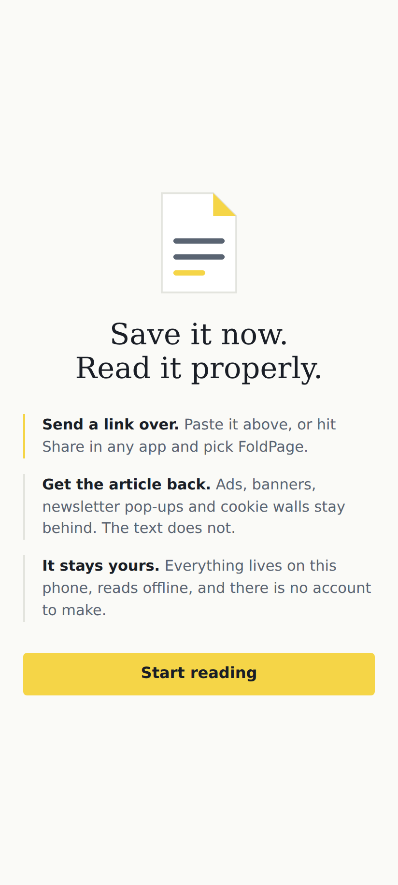
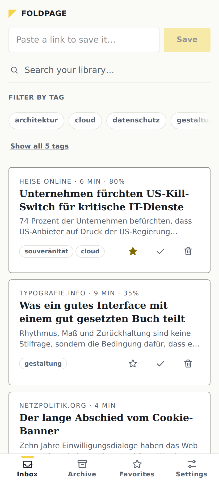
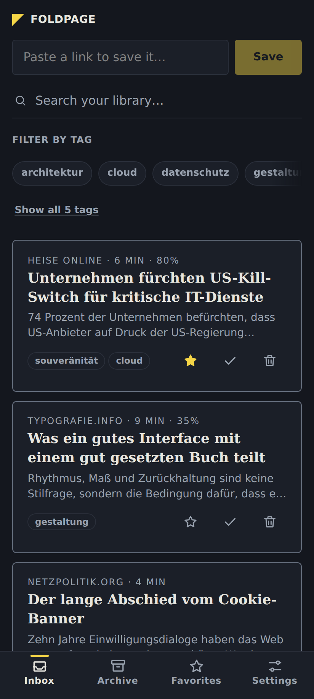
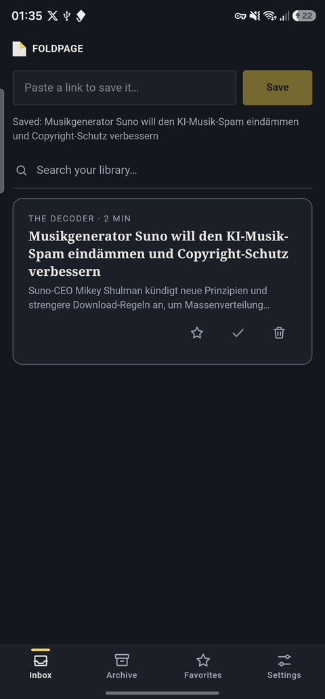
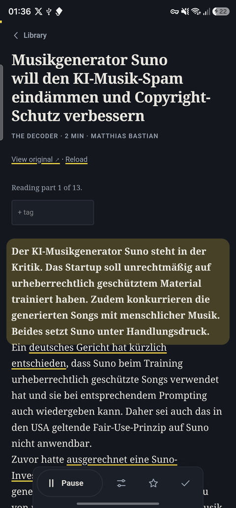
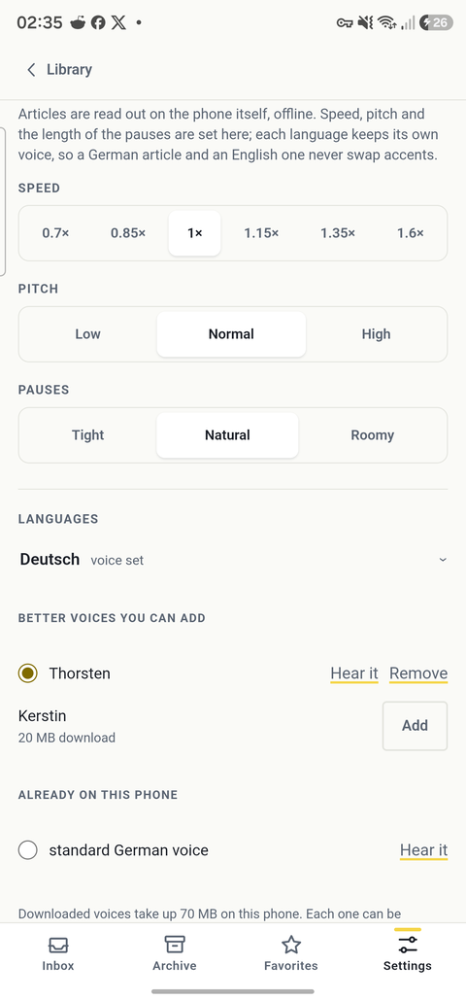
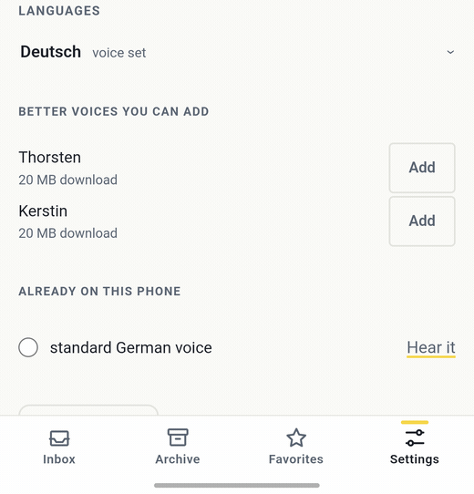
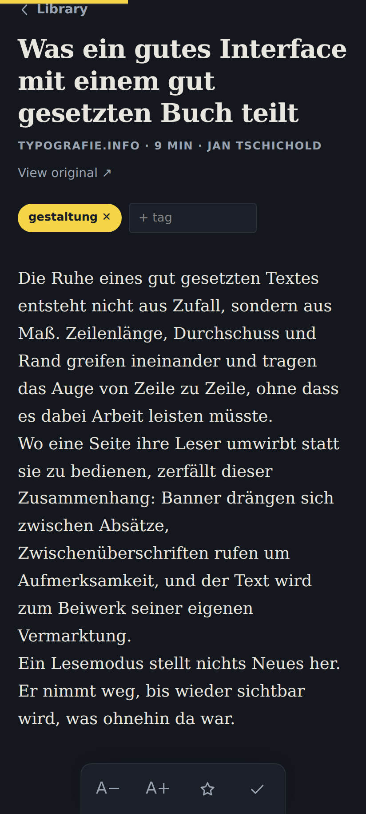
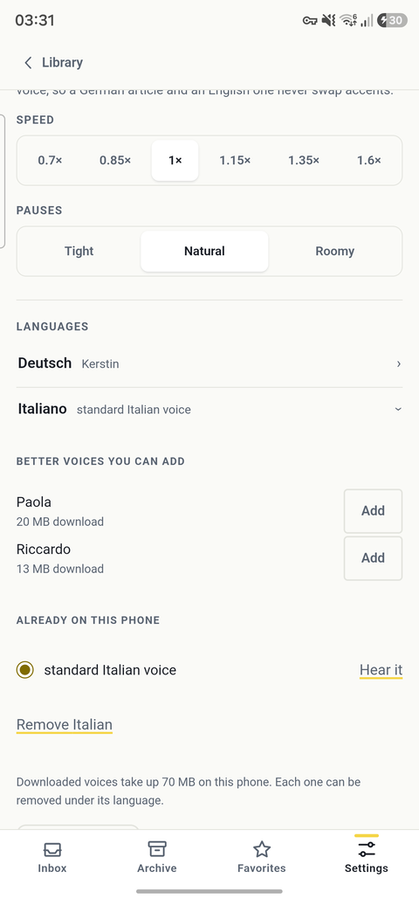

<div align="center">


# FoldPage for Android

**Save an article. Read it clean, offline, whenever.**

A read-it-later app that keeps everything on your phone — no account, no cloud,
no tracking.

[](https://play.google.com/store/apps/details?id=de.ithandwerk.foldpage)
[](#verifying-the-download)
[](https://github.com/BEKO2210/foldpage-android/releases/latest)

<br>





<sub>First launch, the library, and the same library in dark — the theme follows the system.</sub>

</div>

---

## What it does

You send a link to FoldPage. The app fetches the page, strips the ads, banners,
newsletter pop-ups and cookie walls, and keeps the article — text and images —
in local storage. From then on it reads offline, in a typography built for long
text rather than for engagement.

- **Reads aloud, in its own voice** — FoldPage carries a speech engine and can
  fetch a neural voice for your language, about 20 MB, straight inside the app.
  No second app to install, and it works offline once it is there. The phone's
  own voices stay available beside it.
- **A language, then its voices** — pick a language and you see the voices for
  *that* language and nothing else: FoldPage's own first, the phone's below,
  each with a listen button before you keep it.
- **Share to save** — hit _Share_ in any app, pick FoldPage, done. The link is
  fetched and filed away in the background.
- **A real reader** — serif or sans, four text sizes, ragged-right or justified
  with proper hyphenation, two line spacings, and a theme that follows your
  system or stays where you put it.
- **Picks up where you stopped** — scroll position is remembered per article and
  a progress bar shows how far in you are.
- **Inbox, Archive, Favorites** — plus free-form tags and full-text search
  across everything, including the article bodies.
- **Deleting is undoable** — a toast with _Undo_, not a modal asking twice.
- **Import and export** — bring a Pocket export (CSV or HTML) or any bookmarks
  file; export to JSON, HTML or Markdown at any time.
- **Offline by construction** — the article's pictures are downloaded and kept
  with it, so a saved page needs no network and opening it tells the publisher
  nothing. The entire app ships inside the APK.
- **Says what it is** — a one-time welcome on first launch explains how a link
  gets in, what comes back, and where it stays.
- **Stays where you left it** — switching sections keeps each one's scroll
  position, and the hardware back button walks back through them instead of
  dropping you out of the app.

## What it looks like

<div align="center">





<sub>The library, an article being read aloud, and the voices for one language.
Photographed on a Galaxy S23 Ultra, not mocked up.</sub>

<br><br>



<sub>Adding a voice, start to finish, inside the app: size before the tap, a bar
while it arrives, and a voice you can listen to before you keep it.</sub>

</div>

|                                                                                                                        |                                                                                                                                                                                             |
| ---------------------------------------------------------------------------------------------------------------------- | ------------------------------------------------------------------------------------------------------------------------------------------------------------------------------------------- |
|                             | **The reader** — serif body text at one of four sizes, a hairline progress bar at the top, and one labelled control for the thing the app is for. Everything the page carried around the article is gone. |
|  | **Every language, not just yours** — 31 voices across 22 languages, two for German, English, French, Italian, Spanish, Dutch, Portuguese, Polish and Russian. A language the phone cannot speak is one download away. |

## Privacy

There is no account, no analytics, no crash reporting, no ad SDK. The app makes
exactly two kinds of outbound request, both of which you start yourself:
fetching a page you asked it to save, and downloading a voice you asked it to
add (from the sherpa-onnx release on GitHub — the same file for everybody, with
nothing about you in the request). Reading aloud itself happens on the phone:
no sentence of any article ever leaves the device.

Your library lives in the app's private storage on the device and is never
uploaded anywhere. Permissions requested: `INTERNET` and `VIBRATE` — that's the
complete list.

The full wording lives on the project page:
[Datenschutz](https://beko2210.github.io/foldpage-android/datenschutz/) ·
[Impressum](https://beko2210.github.io/foldpage-android/impressum/) — both are
also linked from the app's settings screen.

## Install

1. Grab `foldpage-<version>.apk` from the
   [Releases](https://github.com/BEKO2210/foldpage-android/releases) page.
2. Open it on your phone and confirm the install.

Two prompts are unavoidable when installing an app from outside the Play Store,
and they are not a sign anything is wrong:

- **"Allow installs from this source?"** — Android asks once per app that hands
  over an APK (your browser or file manager). Allow it, then install.
- **A Play Protect scan notice** — Google flags every app it has not seen
  before. Tap _Install anyway_. Verify the fingerprint below if you want
  certainty about who built the file.

Requires Android 7.0 (API 24) or newer.

The APK here is a universal one — it carries the speech engine for all four
processor types, which is why it is around 120 MB. The Play Store build is split
per device and downloads about 30 MB. Voices are not in either: they are fetched
on demand, about 20 MB each, only for languages you ask for.

### Verifying the download

```bash
apksigner verify --print-certs foldpage-<version>.apk
```

Signing certificate SHA-256:

```
84:50:48:E1:19:8E:0C:8C:2C:88:34:68:CD:14:14:46:03:13:76:4A:4A:CB:C7:CE:3A:D0:46:99:B0:A9:72:72
```

If that fingerprint does not match, the file is not the one built here.

The key changed with 1.5, which is also the upload key for Google Play. Builds
up to 1.4 carried a different certificate
(`DE:B2:4E:26:…:85:8F`), so Android refuses to update a 1.4 install in place —
uninstall it first. Nothing was published under the old key.

## How it is built

A Next.js app, statically exported and wrapped in a Capacitor WebView. There is
no server anywhere in the picture — the parts that used to run on one were moved
onto the device:

| Concern                | How it works on the phone                                                                                     |
| ---------------------- | ------------------------------------------------------------------------------------------------------------- |
| Fetching a page        | `CapacitorHttp` — native, so no CORS wall and real redirects                                                  |
| Extracting the article | `@mozilla/readability` against a `DOMParser` document                                                         |
| Sanitizing             | an allowlist of tags, attributes and URL schemes, applied in an inert document before anything is stored      |
| Storage                | IndexedDB via `idb` — the text, plus each image once, keyed by the SHA-256 of its URL                         |
| Sharing into the app   | a small Capacitor plugin (`ShareTargetPlugin.java`) that catches `ACTION_SEND`, on cold start as well as warm |
| Exports                | written to _Documents_, then handed to the Android share sheet                                                |

### Build it yourself

```bash
npm install
npm run build          # static export into out/
npx cap sync android
cd android && ./gradlew assembleDebug
```

`npm test` runs the unit tests — article extraction, plus the contrast and
motion constraints below. Release builds come from `./gradlew bundleRelease` and
need the signing keystore, which is not in this repository.

### Constraints that are tested, not just documented

Two things that are easy to break silently are pinned by tests rather than
prose, so a regression fails the run instead of shipping:

- [`docs/CONTRAST.md`](docs/CONTRAST.md) — every text role in both themes,
  enforced by `lib/contrast.test.ts` at WCAG AA (4.5:1 for body text).
- [`docs/MOTION.md`](docs/MOTION.md) — every animation with its duration and
  fill mode, enforced by `lib/motion.test.ts`. Page wrappers use `backwards`
  fill on purpose: a lingering `transform` turns an element into the containing
  block for its `position: fixed` children, which is exactly how the bottom
  navigation once ended up floating in the middle of the screen.

## Project layout

```
app/            routes: library, reader (/read/?id=), settings
components/     UI — Library, AppNav (persistent bottom bar), TopBar,
                TagEditor, icons
lib/            db (IndexedDB), parse (extraction), native (Capacitor bridge),
                importExport, tests
android/        the Capacitor Android project incl. the share-target plugin
docs/           architecture map and roadmap, release runbook, contrast and
                motion audits, screenshots, and the legal pages published via
                GitHub Pages
scripts/        icon/splash generation and the signed release build
```


## Status

Version 1.12 — local-only, no account, in closed testing on Google Play. Reading
aloud now runs on FoldPage's own engine with voices it fetches itself; the
phone's voices remain available. Sync between devices exists in the web version
and is deliberately absent here.

Measured rather than asserted, on every change: 58 unit tests, an extraction
corpus of 39 real articles from 22 sites, 148 rendered reader pages with no
failures, a browser pass over every route in four modes (seeded, empty, offline,
dark) for console errors, overflow and sideways drag, an audit that hunts
developer words in the rendered interface, 27 checks on the language → voice
rule, 12 on keyboard operation, and a structural accessibility audit. What those
cannot judge — the order TalkBack announces things in, whether the motion feels
right in a hand — is listed as unverified in
[`docs/UI-BASELINE.md`](docs/UI-BASELINE.md) rather than implied.

Where the work goes next: [`docs/ROADMAP.md`](docs/ROADMAP.md). How the app is
put together: [`docs/ARCHITECTURE.md`](docs/ARCHITECTURE.md).

## License

Free to use, not free to modify or redistribute. See [LICENSE.md](LICENSE.md).
The open source libraries this app builds on keep their own licenses — see
[THIRD-PARTY-NOTICES.md](THIRD-PARTY-NOTICES.md).
